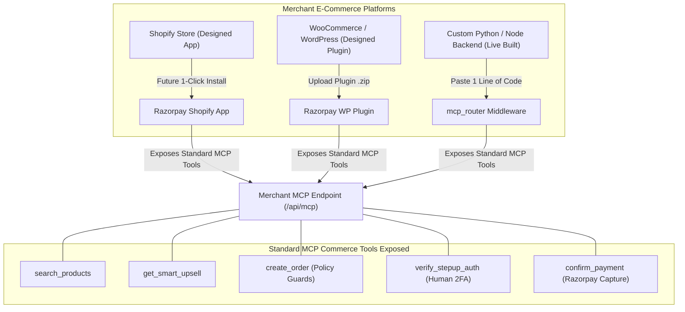
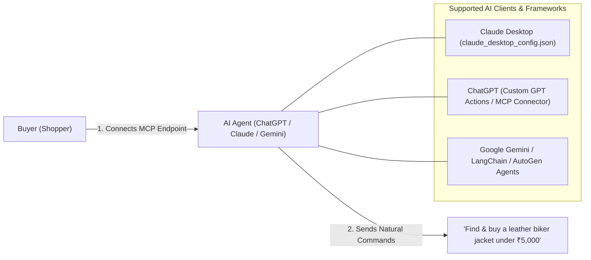

# Razorpay AI-Commerce Adapter — Pitch & Business Presentation Guide
> **Comprehensive Pitch, Architecture Blueprint & Live Demo Script for Judges & Merchants**

---

## 1. The 30-Second Elevator Pitch

> *"Today, millions of shoppers are using AI assistants like ChatGPT, Claude, and Gemini to find products. But when an AI finds something a customer wants, it hits a brick wall — the customer has to leave the AI, open a browser, search the site manually, and fill out checkout forms.
> 
> Our solution, the **Universal AI-Commerce Adapter for Razorpay Merchants**, acts as an intelligent bridge. It enables any online merchant to expose standard Model Context Protocol (MCP) commerce tools. 
> 
> Buyers add this MCP connection to their ChatGPT, Claude, or Gemini AI agents. When a user asks their AI to buy a product, the AI queries the merchant's catalog via MCP, evaluates AI cross-sell recommendations, enforces strict merchant spending limits, and triggers human approval when caps are exceeded — executing 1-click Razorpay payments with real-time audit logging."*

---

## 2. Dedicated Integration & Architecture Blueprint

### Slide A: How Merchants Attach MCP to Their Website (Vendor Side)



1. **Custom Python / Node Stack (Live Built):** Add 1 line of router middleware: `app.include_router(mcp_router, prefix="/api/mcp")`.
2. **Shopify & WooCommerce Stores (Designed Integration Architecture):** Designed for zero-code 1-click app installation from the Shopify App Store or WordPress plugin upload.

---

### Slide B: How Users Add MCP to Their AI Agents (Buyer Side)



1. **Claude Desktop:** User adds merchant adapter URL to `claude_desktop_config.json`:
   ```json
   {
     "mcpServers": {
       "razorpay-commerce": {
         "url": "http://localhost:8000/api/mcp/tools"
       }
     }
   }
   ```
2. **ChatGPT / Custom GPTs:** Add OpenAPI / MCP endpoint as a Custom Action in 1 click.
3. **Gemini & Autonomous Agents:** Native MCP tool binding in Python/TypeScript.

---

### Slide C: Centralized Multi-Store Network (Vision & Roadmap)

```mermaid
graph TD
    BuyerAgent["Buyer AI Agent (ChatGPT / Claude / Gemini)"] <-->|MCP Standard| Hub["Razorpay Multi-Store Commerce Hub (Network Vision)"]
    
    Hub <-->|Query MCP Tool: search_products| VendorA["Merchant A (Leather Store)"]
    Hub <-->|Query MCP Tool: search_products| VendorB["Merchant B (Apparel Store)"]
    Hub <-->|Query MCP Tool: search_products| VendorC["Merchant C (Gadgets Store)"]
    
    subgraph Autonomous Merchant Selection (Future Vision)
        Compare["1. Compare Specs & Stock"]
        Price["2. Compare Prices & Delivery"]
        Best["3. Select Optimal Merchant & Item"]
    end
    
    Hub --> Compare --> Price --> Best
    Best -->|Execute Payment| Razorpay["Razorpay Payment Gateway Rails"]
```

> **The Network Vision:**  
> Our adapter builds the **node engine** for every Razorpay merchant. As thousands of merchants adopt the MCP adapter, Razorpay can aggregate them into a central **Multi-Store Commerce Hub**, allowing AI agents to search across the entire network and route transactions seamlessly.

---

## 3. Live Competition Demo Script (4 Key Scenes)

Walk through these 4 scenes during the live competition demo:

### 🎬 Scene 1: Product Discovery & Intent Matching
- **Action:** In AI Sandbox, prompt: *"Find a Vintage Leather Biker Jacket under ₹5,000 and buy it."*
- **Judges Pitch:** *"Watch how the AI agent invokes `search_products` via MCP. It searches our merchant catalog, matches the Vintage Leather Biker Jacket (`APEX-JKT-001`) priced at ₹4,499.00, and verifies inventory stock."*

### 🎬 Scene 2: Smart Growth Upsell Engine
- **Action:** Show the agent invoking `get_smart_upsell` to recommend a complementary item (e.g. RFID Slim Leather Wallet `APEX-ACC-002` at ₹1,199).
- **Judges Pitch:** *"Our adapter doesn't just process sales; it actively drives growth by executing `get_smart_upsell` to boost Average Order Value (AOV) for merchants."*

### 🎬 Scene 3: Policy Guardrails & Price Integrity
- **Action:** Prompt: *"Buy ANC Wireless Earbuds under ₹1,000."*
- **Judges Pitch:** *"The store's ANC Earbuds cost ₹3,499. The policy engine blocks the match, protecting the buyer's budget cap."*

### 🎬 Scene 4: Spending Limit Breach & Human Approval Drawer
- **Action:** Prompt: *"Buy a Vintage Leather Biker Jacket and a Minimalist Chronograph Watch under INR 10,000."* Total order reaches ₹8,398.00, exceeding the merchant's ₹5,000 autonomous cap.
- **Judges Pitch:** *"Because the order total (₹8,398) exceeds the ₹5,000 autonomous spending limit, the adapter safely pauses the order. The 1-Click Approval Drawer slides up on screen. Once the user clicks Approve, Razorpay captures payment instantly, and the real-time audit log displays every trace on the merchant dashboard."*

---

## 4. Key Business Value Summary

| Stakeholder | Key Benefit |
| :--- | :--- |
| **Merchants (Vendors)** | 1-line MCP attachment; instant access to AI shoppers; automated growth upsells; spending caps to eliminate fraud. |
| **Buyers (Shoppers)** | 1-click setup on ChatGPT/Claude/Gemini; natural language shopping; explicit budget safety & human approval gates. |
| **Razorpay (The Platform)** | Provides the foundational AI commerce node engine for merchants; captures transaction volume across the Agentic Economy. |
